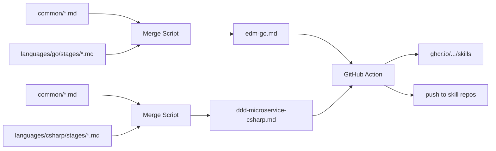

# emd-skills

```mermaid

graph LR
    A[common/*.md] --> C[Merge Script]
    B[languages/go/stages/*.md] --> C
    C --> D[edm-go.md]
    
    A2[common/*.md] --> C2[Merge Script]
    B2[languages/csharp/stages/*.md] --> C2
    C2 --> D2[ddd-microservice-csharp.md]
    
    D --> E[GitHub Action]
    D2 --> E
    E --> F[ghcr.io/.../skills]
    E --> G[push to skill repos]
	
```